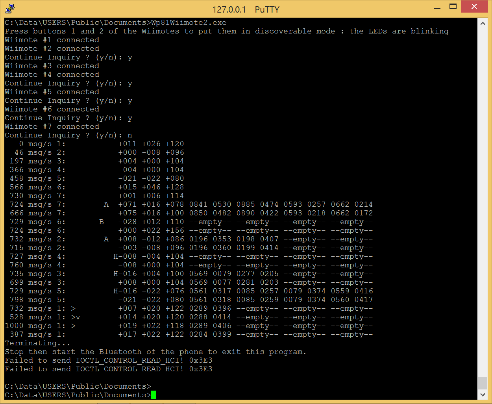

# Wp81Wiimote2

An other demonstration of the usage of a Wiimote with Windows Phone 8.1  
This time, the communication is done at the HCI level.  
Works with genuine and 3rd party Wiimotes. 
Can connect up to 7 Wiimotes.

See also my previous projects on the same topic:  
- [Wp81Wiimote](https://github.com/fredericGette/Wp81Wiimote)
- [Wp81WiimoteDriver](https://github.com/fredericGette/Wp81WiimoteDriver)

> [!WARNING]
> Currently only compatible with Nokia Lumia 520.  

## Usage

Wp81wiimote2 executes the following steps:  
- Stop the communication between the Windows Bluetooth stack and the Qualcomm Bluetooth stack.  
- Reset the Bluetooth controller.  
- Start *Inquiry* in a loop to detect Bluetooth devices (you have to press simultaneously the buttons 1 and 2 of the Wiimote or the _sync button_). 
- Establish a Bluetooth connection with the Bluetooth devices.
- Open and configure a *HID control* channel with the Bluetooth devices.
- Open and configure a *HID interrupt* channel with the Bluetooth devices.
- Set the LED of the Wiimotes (the LED# corresponds to the order of the detection of the Wiimote).
- Start again the *Inquiry* phase until the user chooses to stop it.
- Activate the IR camera.
- Read the inputs of the Wiimotes (buttons, accelerometer, IR data).

To stop the executable, press Ctrl+C, then disable Bluetooth on the Windows Phone (to finish the pending read events).  

The optional parameter `-v` increase the verbosity of the program.


The program displays the inputs received from the Wiimotes.  
A new line is displayed each time a button is pressed or released.  
The format of a line is the following:  
```
MMMM msg/s #:<>v^+21BA-H ±XXX ±YYY ±ZZZ x1x1 y1y1 x2x2 y2y2 x3x3 y3y3 x4x4 y4y4
```
Where:
- `MMMM msg/s` is the number of ACL messages received by second.
- `#` is the number assigned to the Wiimote.
- `<` is D-Pad left.
- `>` is D-Pad right.
- `v` is D-Pad down.
- `^` is D-Pad up.
- `+` is Plus button.
- `2` is Two button.
- `1` is One button.
- `B` is B button.
- `A` is A button.
- `-` is Minus button.
- `H` is Home button.
- `±XXX` is the value of the acceleration in the X axis.
- `±YYY` is the value of the acceleration in the Y axis.
- `±ZZZ` is the value of the acceleration in the Z axis.
- `x1x1` is the x coordinate of the first tracked object.
- `y1y1` is the y coordinate of the first tracked object.
- `x2x2` is the x coordinate of the second tracked object.
- `y2y2` is the y coordinate of the second tracked object.
- `x3x3` is the x coordinate of the third tracked object.
- `y3y3` is the y coordinate of the third tracked object.
- `x4x4` is the x coordinate of the fourth tracked object.
- `y4y4` is the y coordinate of the fourth tracked object.
  
## Deployment

- [Install a telnet server on the phone](https://github.com/fredericGette/wp81documentation/tree/main/telnetOverUsb#readme), in order to run the application.  
- Manually copy the executable from the root of this GitHub repository to the shared folder of the phone.
> [!NOTE]
> When you connect your phone with a USB cable, this folder is visible in the Explorer of your computer. And in the phone, this folder is mounted in `C:\Data\USERS\Public\Documents`  

### Installation of the kernel drivers "wp81controldevice.sys" and "wp81hcifilter.sys"

> [!NOTE]
> They are currently exactly the same drivers than those used by [wp81btmon](https://github.com/fredericGette/wp81btmon).  

#### Legacy driver "wp81controldevice.sys"

This driver allows communication between the *wp8wiimote2* executable and the filter driver.

- Manually copy the .sys from the driver folder of this GitHub repository to the shared folder of the phone.
- Install the driver:
```
sc create wp81controldevice type= kernel binPath= C:\Data\USERS\Public\Documents\wp81controldevice.sys
```
- Start the driver:
```
sc start wp81controldevice
```

> [!NOTE]
> You have to start the control driver after every reboot of the phone.  

#### Filter driver "wp81hcifilter.sys"

This driver filters the IOCtls exchanged between the Windows Bluetooth stack and the Qualcomm Bluetooth stack.

- Manually copy the .sys from the driver folder of this GitHub repository to the shared folder of the phone.
- Install the driver:
```
reg ADD "HKLM\SYSTEM\CurrentControlSet\Services\wp81hcifilter"
reg ADD "HKLM\SYSTEM\CurrentControlSet\Services\wp81hcifilter" /V Description /T REG_SZ /D "WP81 HCI Filter driver"
reg ADD "HKLM\SYSTEM\CurrentControlSet\Services\wp81hcifilter" /V DisplayName /T REG_SZ /D "wp81HCIFilter"
reg ADD "HKLM\SYSTEM\CurrentControlSet\Services\wp81hcifilter" /V ErrorControl /T REG_DWORD /D 1
reg ADD "HKLM\SYSTEM\CurrentControlSet\Services\wp81hcifilter" /V Start /T REG_DWORD /D 3
reg ADD "HKLM\SYSTEM\CurrentControlSet\Services\wp81hcifilter" /V Type /T REG_DWORD /D 1
reg ADD "HKLM\SYSTEM\CurrentControlSet\Services\wp81hcifilter" /V ImagePath /T REG_EXPAND_SZ  /D  "\??\C:\Data\USERS\Public\Documents\wp81hcifilter.sys"
reg ADD "HKLM\System\CurrentControlSet\Enum\SystemBusQc\SMD_BT\4&315a27b&0&4097" /V LowerFilters /T REG_MULTI_SZ /D "wp81hcifilter"
```
- Start the driver:
```
powertool -reboot
```

> [!NOTE]
> The filter driver automatically starts when the Bluetooth stack boots (ie when the phone boots and Bluetooth is enabled).

> [!NOTE]
> You can inspect the logs of the drivers using [wp81debug](https://github.com/fredericGette/wp81debug)  
> `wp81debug.exe dbgprint | findstr /C:"Control!" /C:"HCI!"`
> And parse them using [hciexplorer](https://github.com/fredericGette/hciexplorer) in *command line* version.

## References

Wiimote specifications are available at [Wiimote - WiiBrew](https://wiibrew.org/wiki/Wiimote)

`(a2) 12 04 33` requests continuous reporting.  
The frequency is ~100 reports/s with a genuine Wiimote, but can be ~250 reports/s with a 3rd party Wiimote.  
The maximum read rate of the current version of this program seems to be around 650 reports/s.  
